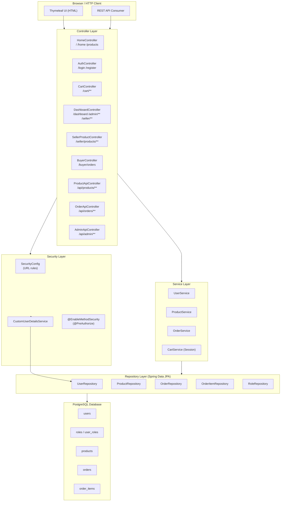
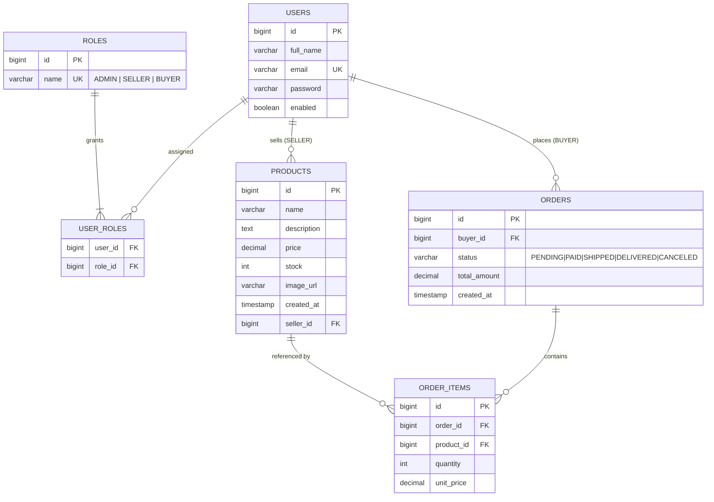
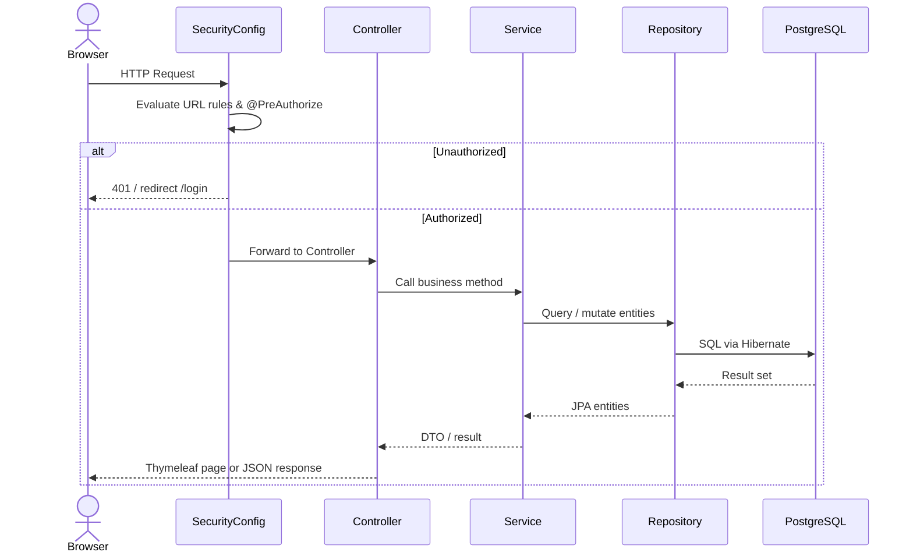
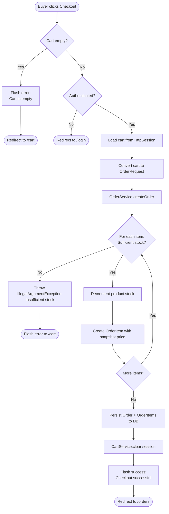

# Hexashop — Mini Marketplace

Hexashop is a full-stack mini marketplace built for the CSE-3220 Software Engineering Lab. It is powered by Spring Boot 4, Thymeleaf, PostgreSQL, and Spring Security with three distinct roles — **ADMIN**, **SELLER**, and **BUYER**. The application is fully Dockerized, CI-tested via GitHub Actions, and deployed on Render through an automated delivery pipeline.

---

## Live Demo & Repository

| Item              | Value                                                  |
| ----------------- | ------------------------------------------------------ |
| Live URL (Render) | `https://cse-3220-hexashop-software-project.onrender.com/`                                                                        |
| Docker Hub Image  | `arkanath55/cse_3220_hexashop_software_project:latest` |

**Seed / Demo Accounts** (created automatically on first boot)

| Role   | Email                 | Password    |
| ------ | --------------------- | ----------- |
| ADMIN  | `admin@hexashop.com`  | `admin123`  |
| SELLER | `seller@hexashop.com` | `seller123` |
| BUYER  | `buyer@hexashop.com`  | `buyer123`  |

> **Note:** Seller accounts registered via the public form are **disabled** until an ADMIN approves them. The demo seller is pre-enabled by the seed initializer.

---

## Table of Contents

1. [Project Description](#project-description)
2. [Architecture Diagram](#architecture-diagram)
3. [ER Diagram](#er-diagram)
4. [System Workflow Diagram](#system-workflow-diagram)
5. [Activity Diagram — Checkout Flow](#activity-diagram--checkout-flow)
6. [Features & Role-Permission Matrix](#features--role-permission-matrix)
7. [Tech Stack](#tech-stack)
8. [Authentication & Authorization](#authentication--authorization)
9. [API Endpoints](#api-endpoints)
10. [Run Instructions](#run-instructions)
11. [CI/CD Pipeline](#cicd-pipeline)
12. [GitHub Branch Protection](#github-branch-protection)
13. [Repository Structure](#repository-structure)
14. [Design Patterns](#design-patterns)
15. [Testing](#testing)
16. [Configuration (Environment Variables)](#configuration-environment-variables)
17. [Admin Semantics & Data Lifecycle](#admin-semantics--data-lifecycle)
18. [Troubleshooting](#troubleshooting)

---

## Project Description

Hexashop is a two-sided marketplace where sellers list products and buyers purchase them. The application enforces strict role isolation:

- **Buyers** browse the product catalog, manage a session-based shopping cart, and check out to create orders. They can view their order history.
- **Sellers** manage their own product listings (create, restock, delete) and can update the status of orders that contain their products.
- **Admins** have a global dashboard: they manage user accounts, approve pending seller registrations, update any order status, and remove products.

The architecture follows a classic Spring MVC layered pattern, fully separating business logic (services) from persistence (repositories) and presentation (Thymeleaf templates + REST controllers).

### Order Status Machine

Orders move through the following states:

```
PENDING → PAID → SHIPPED → DELIVERED
           └──→ CANCELED
```

| Transition                    | Who can trigger                               |
| ----------------------------- | --------------------------------------------- |
| Any status change             | ADMIN (via dashboard)                         |
| PENDING → SHIPPED / DELIVERED | SELLER (for orders containing their products) |
| PENDING → CANCELED            | SELLER (for their relevant orders)            |

---

## Architecture Diagram

> Mermaid source: [docs/diagrams/architecture.md](docs/diagrams/architecture.md)



---

## ER Diagram

> Mermaid source: [docs/diagrams/er-diagram.md](docs/diagrams/er-diagram.md)



**Constraints / Indexes**

| Constraint        | Column                                  |
| ----------------- | --------------------------------------- |
| UNIQUE            | `users.email`                           |
| UNIQUE            | `roles.name`                            |
| FK                | `products.seller_id → users.id`         |
| FK                | `orders.buyer_id → users.id`            |
| FK                | `order_items.order_id → orders.id`      |
| FK                | `order_items.product_id → products.id`  |
| Recommended index | `products.seller_id`, `orders.buyer_id` |

> **Note:** The cart is **session-based** (stored in `HttpSession`) and has no corresponding database table. It is converted to an `OrderRequest` at checkout time.

---

## Entities

### Cardinality, Participation, and Degree

| Entity        | Relationship               | Cardinality                                        | Participation | Degree |
| ------------- | -------------------------- | -------------------------------------------------- | ------------- | ------ |
| `USERS`       | `USERS` ↔ `USER_ROLES`     | One user can have zero or many `USER_ROLES` rows   | Partial       | Binary |
| `ROLES`       | `ROLES` ↔ `USER_ROLES`     | One role can have zero or many `USER_ROLES` rows   | Partial       | Binary |
| `USER_ROLES`  | `USER_ROLES` ↔ `USERS`     | Many `USER_ROLES` rows map to one user             | Total         | Binary |
| `USER_ROLES`  | `USER_ROLES` ↔ `ROLES`     | Many `USER_ROLES` rows map to one role             | Total         | Binary |
| `USERS`       | `USERS` ↔ `PRODUCTS`       | One seller user can have zero or many products     | Partial       | Binary |
| `PRODUCTS`    | `PRODUCTS` ↔ `USERS`       | Many products map to one seller user               | Total         | Binary |
| `USERS`       | `USERS` ↔ `ORDERS`         | One buyer user can place zero or many orders       | Partial       | Binary |
| `ORDERS`      | `ORDERS` ↔ `USERS`         | Many orders map to one buyer user                  | Total         | Binary |
| `ORDERS`      | `ORDERS` ↔ `ORDER_ITEMS`   | One order can contain zero or many order items     | Partial       | Binary |
| `ORDER_ITEMS` | `ORDER_ITEMS` ↔ `ORDERS`   | Many order items map to one order                  | Total         | Binary |
| `PRODUCTS`    | `PRODUCTS` ↔ `ORDER_ITEMS` | One product can appear in zero or many order items | Partial       | Binary |
| `ORDER_ITEMS` | `ORDER_ITEMS` ↔ `PRODUCTS` | Many order items map to one product                | Total         | Binary |

> **Note:** The cart is session-based and is not a database entity, so it is not included in the entity analysis.

---

## System Workflow Diagram

> Mermaid source: [docs/diagrams/system-workflow.md](docs/diagrams/system-workflow.md)



---

## Activity Diagram — Checkout Flow

> Mermaid source: [docs/diagrams/activity-checkout.md](docs/diagrams/activity-checkout.md)



---

## Features & Role-Permission Matrix

### Feature List

- Public product browsing (`/`, `/home`, `/products`, `/products/{id}`)
- Product detail viewing
- Product search by name (case-insensitive)
- User registration with role selection (`BUYER` or `SELLER`)
- Seller self-registration in pending (`enabled = false`) state until admin approval
- Session-based login and logout with Spring Security
- Role-aware dashboard redirection (`/dashboard` → admin/seller/buyer dashboard)
- Admin dashboard for users, pending sellers, orders, and products
- Seller dashboard for product and order management
- Buyer dashboard for product and order access
- Seller product creation
- Seller product deletion
- Seller product restocking
- Ownership enforcement for seller product operations
- Admin ability to update, delete, and restock any product
- Session-based cart management (add, update, remove, clear)
- Checkout flow from cart to persisted `Order` and `OrderItem` records
- Stock validation and stock decrement during checkout
- Buyer order creation and order history viewing
- Seller order viewing for orders related to seller products
- Seller order status updates for relevant orders only
- Admin global order status management
- Admin seller approval workflow
- Admin direct seller account creation
- Admin seller-role removal from users
- Admin APIs for listing users and orders
- Product REST APIs for listing, viewing, creating, updating, and deleting products
- Order REST APIs for creating orders and viewing buyer orders

| Capability                         |  ADMIN  | SELLER  | BUYER |
| ---------------------------------- | :-----: | :-----: | :---: |
| Browse / search products           |    ✓    |    ✓    |   ✓   |
| View product detail                |    ✓    |    ✓    |   ✓   |
| Create products                    |    ✗    | ✓ (own) |   ✗   |
| Update products                    | ✓ (any) | ✓ (own) |   ✗   |
| Delete products                    | ✓ (any) | ✓ (own) |   ✗   |
| Restock products                   | ✓ (any) | ✓ (own) |   ✗   |
| Manage session cart                |    ✗    |    ✗    |   ✓   |
| Checkout (create order)            |    ✗    |    ✗    |   ✓   |
| View own orders as buyer           |    ✗    |    ✗    |   ✓   |
| View all orders                    |    ✓    |    ✗    |   ✗   |
| View orders for own products       |    ✗    |    ✓    |   ✗   |
| Update order status (any)          |    ✓    |    ✗    |   ✗   |
| Update order status (own products) |    ✗    |    ✓    |   ✗   |
| Approve pending sellers            |    ✓    |    ✗    |   ✗   |
| Create seller accounts             |    ✓    |    ✗    |   ✗   |
| Remove seller role from user       |    ✓    |    ✗    |   ✗   |
| View all users (admin API)         |    ✓    |    ✗    |   ✗   |

---

## Tech Stack

| Layer            | Technology                                         |
| ---------------- | -------------------------------------------------- |
| Language         | Java 21                                            |
| Framework        | Spring Boot 4.0.4                                  |
| Web / MVC        | Spring Web MVC                                     |
| UI / Templating  | Thymeleaf                                          |
| Security         | Spring Security (session-based form login, BCrypt) |
| Persistence      | Spring Data JPA + Hibernate                        |
| Database         | PostgreSQL 16                                      |
| Validation       | Jakarta Bean Validation (Hibernate Validator)      |
| Build            | Maven (mvnw wrapper)                               |
| Containerization | Docker (multi-stage build), Docker Compose         |
| CI/CD            | GitHub Actions → Docker Hub → Render               |
| Testing          | JUnit 5, Mockito, Spring MockMvc, @SpringBootTest  |
| Utilities        | Lombok                                             |

---

## Authentication & Authorization

Hexashop uses **Spring Security's session-based form login** — there are no JWTs or API keys. Every request carries a server-side session cookie (`JSESSIONID`).

### Authentication Flow (Step by Step)

```
1. User submits POST /login with email + password (form fields)
2. Spring Security invokes CustomUserDetailsService.loadUserByUsername(email)
3. CustomUserDetailsService:
   a. Queries the database for the User entity by email
   b. Loads all associated Roles (EAGER ManyToMany fetch)
   c. Maps each Role to a GrantedAuthority: "ROLE_ADMIN", "ROLE_SELLER", "ROLE_BUYER"
   d. Checks user.enabled — disabled users are rejected at this step
   e. Returns a Spring Security UserDetails object
4. Spring Security compares the submitted password against the BCrypt hash in the DB
5. On success:
   - Creates an HttpSession
   - Stores the Authentication in the SecurityContext
   - Sets the JSESSIONID cookie on the response
   - Redirects to /dashboard (which further redirects by role)
6. On failure: redirects to /login?error
7. On logout (POST /logout): HttpSession is invalidated, SecurityContext cleared
```

### BCrypt Password Hashing

The `PasswordEncoder` is a singleton `BCryptPasswordEncoder` declared in `SecurityConfig`. BCrypt automatically salts every hash, meaning two identical plaintext passwords produce different hashes each time. Raw passwords are **never stored**.

```java
// SecurityConfig.java — Singleton pattern
private static final PasswordEncoder INSTANCE = new BCryptPasswordEncoder();

@Bean
public PasswordEncoder passwordEncoder() {
    return INSTANCE;
}
```

All password encoding happens in `UserService` before persisting the user entity.

### Authorization — Two Layers

Authorization is enforced through **two complementary mechanisms**:

#### Layer 1 — URL-Level Rules (`SecurityConfig`)

Configured via `HttpSecurity.authorizeHttpRequests`. These rules apply to every request before any controller code runs.

| URL Pattern                     | Access                                |
| ------------------------------- | ------------------------------------- |
| `/`, `/home`, `/products/**`    | Public (no login needed)              |
| `/login`, `/register`, `/error` | Public                                |
| Everything else                 | `authenticated()` — must be logged in |

> Public URL rules allow product browsing without login. Sensitive operations (cart, checkout, dashboards, admin API) are automatically gated because they are not in the permit-all list.

#### Layer 2 — Method-Level Rules (`@PreAuthorize`)

`@EnableMethodSecurity` is active in `SecurityConfig`, which enables the `@PreAuthorize` annotation on controller and service methods. This provides fine-grained, role-based access control beyond URL-level patterns.

```java
// AdminApiController — all endpoints restricted to ADMIN role only
@PreAuthorize("hasRole('ADMIN')")
public List<UserResponse> users() { ... }

// ProductApiController — write operations require SELLER or ADMIN
@PreAuthorize("hasAnyRole('SELLER','ADMIN')")
public ResponseEntity<ProductResponse> createProduct(...) { ... }

// OrderApiController — order creation requires BUYER or ADMIN
@PreAuthorize("hasAnyRole('BUYER','ADMIN')")
public ResponseEntity<OrderResponse> createOrder(...) { ... }

// CartController — checkout requires any authenticated user with a valid role
@PreAuthorize("hasAnyRole('BUYER','SELLER','ADMIN')")
public String checkout(...) { ... }
```

#### Layer 3 — Ownership Checks (Service Layer)

Beyond role checks, **resource ownership** is verified inside the service layer. A SELLER may only edit or delete their own products:

```java
// ProductService.java
if (!admin && !product.getSeller().getId().equals(actor.getId())) {
    throw new ForbiddenOperationException("You can only edit your own products");
}
```

### Seller Approval Workflow

Sellers who self-register through the public form are **created with `enabled = false`**. This means:

- `UserDetails.isEnabled()` returns `false`
- Spring Security blocks login with a "disabled" error
- The account is fully created in the database but inaccessible until activated
- An ADMIN approves them via `POST /admin/sellers/{id}/approve`, which sets `enabled = true`

### Session Logout

`/logout` is handled by Spring Security's default logout filter (configured via `Customizer.withDefaults()`). On POST to `/logout`, it:

1. Invalidates the `HttpSession` (destroys the session-cart as well)
2. Clears the `SecurityContextHolder`
3. Deletes the `JSESSIONID` cookie
4. Redirects to `/login?logout`

### Authorization Error Responses

`GlobalExceptionHandler` (`@ControllerAdvice`) maps exceptions to HTTP status codes for REST endpoints:

| Exception                         | HTTP Status               | Scenario                                                     |
| --------------------------------- | ------------------------- | ------------------------------------------------------------ |
| `ResourceNotFoundException`       | 404 Not Found             | Entity not found by ID                                       |
| `ForbiddenOperationException`     | 403 Forbidden             | Ownership violation (e.g., editing another seller's product) |
| `AccessDeniedException`           | 403 Forbidden             | Spring Security `@PreAuthorize` denied access                |
| `MethodArgumentNotValidException` | 400 Bad Request           | Bean validation failed on request body                       |
| Unexpected `Exception`            | 500 Internal Server Error | Unhandled runtime error                                      |

---

## API Endpoints

Base URL:

- Local: `http://localhost:8080`
- Production: `<RENDER_URL>`

All REST endpoints under `/api/**` return JSON. MVC endpoints return Thymeleaf views.
Authentication for REST: session cookie (`JSESSIONID`) from a prior form login to `/login`.

---

### Auth — Registration & Login

#### `GET /login`

Returns the login page (Thymeleaf HTML).

#### `GET /register`

Returns the registration form (Thymeleaf HTML).

#### `POST /register`

Register a new BUYER or SELLER account via form submission.

**Form body:**

```
fullName=Demo Buyer&email=buyer@example.com&password=secret123&role=BUYER
```

| Role     | Effect                                                                           |
| -------- | -------------------------------------------------------------------------------- |
| `BUYER`  | Account enabled immediately; redirects to `/login?registered`                    |
| `SELLER` | Account created as disabled; redirects to `/login?pendingApproval`               |
| `ADMIN`  | Rejected (`IllegalArgumentException`) — admin accounts cannot be self-registered |

---

### Products

#### `GET /api/products`

List all products. Optional search by name.

**Query param:** `?q=rice`

**Response `200 OK`:**

```json
[
  {
    "id": 1,
    "name": "Basmati Rice",
    "description": "Premium quality long grain rice",
    "price": 120.0,
    "stock": 50,
    "imageUrl": "/uploads/rice.jpg",
    "sellerEmail": "seller@hexashop.com"
  }
]
```

---

#### `GET /api/products/{id}`

Get a single product by ID.

**Response `200 OK`:**

```json
{
  "id": 1,
  "name": "Basmati Rice",
  "description": "Premium quality long grain rice",
  "price": 120.0,
  "stock": 50,
  "imageUrl": "/uploads/rice.jpg",
  "sellerEmail": "seller@hexashop.com"
}
```

**Response `404 Not Found`:**

```json
{
  "timestamp": "2026-04-04T10:00:00",
  "status": 404,
  "error": "Product not found: 99"
}
```

---

#### `POST /api/products`

Create a new product. Requires `SELLER` or `ADMIN` role.

**Request body:**

```json
{
  "name": "Sunflower Oil",
  "description": "Refined sunflower cooking oil",
  "price": 95.0,
  "stock": 30,
  "imageUrl": "https://example.com/oil.jpg"
}
```

**Response `401 Unauthorized`** — caller not logged in.

**Response `403 Forbidden`** — caller is BUYER (not SELLER or ADMIN).

---

#### `PUT /api/products/{id}`

Update an existing product. SELLER must own the product; ADMIN can update any.

**Request body:**

```json
{
  "name": "Sunflower Oil 1L",
  "description": "Updated description",
  "price": 100.0,
  "stock": 25,
  "imageUrl": "https://example.com/oil-updated.jpg"
}
```

**Response `403 Forbidden`** (not the owner and not ADMIN)

---

#### `DELETE /api/products/{id}`

Delete a product. SELLER must own the product; ADMIN can delete any.

---

### Orders

#### `POST /api/orders`

Create an order. Requires `BUYER` or `ADMIN` role.

**Request body:**

```json
{
  "items": [
    { "productId": 1, "quantity": 2 },
    { "productId": 3, "quantity": 1 }
  ]
}
```

**Response `500 Internal Server Error`** (insufficient stock):

```json
{
  "timestamp": "2026-04-04T10:15:00",
  "status": 500,
  "error": "Not enough stock for product: Basmati Rice"
}
```

---

#### `GET /api/orders/my`

Get all orders placed by the authenticated buyer. Requires `BUYER` or `ADMIN`.

**Response `200 OK`:**

```json
[
  {
    "id": 10,
    "buyerEmail": "buyer@hexashop.com",
    "status": "PENDING",
    "totalAmount": 345.00,
    "createdAt": "2026-04-04T10:15:30",
    "items": [ ... ]
  }
]
```

---

#### `GET /api/orders/{id}`

Get a specific order by ID. Requires `BUYER` or `ADMIN`.

**Response `200 OK`:** Same structure as above (single object).

---

### Admin API

All endpoints require the `ADMIN` role. A non-admin caller receives `403 Forbidden`.

#### `GET /api/admin/users`

List all registered users.

**Response `403 Forbidden`** (non-ADMIN caller):

```json
{
  "timestamp": "2026-04-04T10:00:00",
  "status": 403,
  "error": "Access is denied"
}
```

---

#### `GET /api/admin/orders`

List all orders in the system (all buyers, all statuses).

**Response `200 OK`:** Array of `OrderResponse` objects — same shape as `/api/orders/my`.

---

### Dashboard / MVC Endpoints (Thymeleaf Pages)

| Method | URL                             | Role              | Description                                |
| ------ | ------------------------------- | ----------------- | ------------------------------------------ |
| `GET`  | `/dashboard`                    | Any authenticated | Role-based redirect dispatcher             |
| `GET`  | `/admin/dashboard`              | ADMIN             | Admin overview page                        |
| `GET`  | `/seller/dashboard`             | SELLER            | Seller product/order management            |
| `GET`  | `/buyer/dashboard`              | BUYER             | Buyer order/product view                   |
| `GET`  | `/orders`                       | Any authenticated | Buyer order history page                   |
| `GET`  | `/cart`                         | Any               | Shopping cart page                         |
| `POST` | `/cart/add`                     | Any               | Add item to session cart (form or AJAX)    |
| `POST` | `/cart/update`                  | Any               | Update cart item quantity                  |
| `POST` | `/cart/remove`                  | Any               | Remove item from cart                      |
| `POST` | `/cart/checkout`                | Any authenticated | Place order from cart contents             |
| `POST` | `/buyer/orders`                 | BUYER/ADMIN       | Place single-item order directly           |
| `POST` | `/seller/products`              | SELLER/ADMIN      | Create product (multipart form with image) |
| `POST` | `/seller/products/{id}/delete`  | SELLER/ADMIN      | Delete own product                         |
| `POST` | `/seller/products/{id}/restock` | SELLER/ADMIN      | Increase product stock                     |
| `POST` | `/seller/orders/{id}/status`    | SELLER/ADMIN      | Update order status for own products       |
| `POST` | `/admin/sellers`                | ADMIN             | Create a new seller account directly       |
| `POST` | `/admin/sellers/{id}/approve`   | ADMIN             | Enable a pending seller account            |
| `POST` | `/admin/sellers/{id}/remove`    | ADMIN             | Remove seller role from a user             |
| `POST` | `/admin/orders/{id}/status`     | ADMIN             | Update any order's status                  |
| `POST` | `/admin/products/{id}/delete`   | ADMIN             | Delete any product                         |

---

### HTTP Status Code Summary

| Code                        | Meaning                                                         |
| --------------------------- | --------------------------------------------------------------- |
| `200 OK`                    | Successful GET or update                                        |
| `201 Created`               | Successful resource creation (order, product)                   |
| `204 No Content`            | Successful deletion (no response body)                          |
| `400 Bad Request`           | Bean validation failed — field errors returned in body          |
| `401 Unauthorized`          | Request requires authentication (not logged in)                 |
| `403 Forbidden`             | Authenticated but insufficient role, or not the resource owner  |
| `404 Not Found`             | Requested entity does not exist                                 |
| `500 Internal Server Error` | Unhandled runtime error (e.g., insufficient stock during order) |

---

## Run Instructions

### Prerequisites

- Java 21+
- Maven (or use the included `./mvnw` wrapper — no global Maven install needed)
- PostgreSQL 16+ **OR** Docker Desktop

---

### Option A — Run Locally (No Docker)

1. **Create the database:**

   ```sql
   CREATE DATABASE cse_3220_SoftwareProjectHexaShop;
   ```

2. **Export environment variables:**

   ```bash
   export SPRING_DATASOURCE_URL=jdbc:postgresql://localhost:5432/cse_3220_SoftwareProjectHexaShop
   export SPRING_DATASOURCE_USERNAME=postgres
   export SPRING_DATASOURCE_PASSWORD=your_password
   export PORT=8080
   ```

3. **Run:**

   ```bash
   cd SoftwareProjectHexashop
   ./mvnw spring-boot:run
   ```

4. **Open:** `http://localhost:8080`

Hibernate auto-creates tables on first run (`ddl-auto: update`). Demo seed data (admin, seller, buyer, products) is inserted automatically on startup.

---

### Option B — Run with Docker Compose (Recommended)

1. **Create `.env`** inside `SoftwareProjectHexashop/`:

   ```env
   POSTGRES_DB=hexashopdb
   POSTGRES_USER=postgres
   POSTGRES_PASSWORD=change_me

   SPRING_DATASOURCE_URL=jdbc:postgresql://postgres:5432/hexashopdb
   SPRING_DATASOURCE_USERNAME=postgres
   SPRING_DATASOURCE_PASSWORD=change_me

   APP_LOGIN_USER=admin
   APP_LOGIN_PASSWORD=admin123
   PORT=8080
   ```

2. **Start:**

   ```bash
   cd SoftwareProjectHexashop
   docker compose up --build
   ```

   Services started:
   - `hexashop-postgres` — PostgreSQL 16, host port `5433`
   - `hexashop-app` — Spring Boot app, host port `8080`
   - `postgres_data` — named volume for data persistence

3. **Open:** `http://localhost:8080`

4. **Stop:**
   ```bash
   docker compose down          # stop containers, keep data volume
   docker compose down -v       # stop containers AND delete data volume
   ```

---

### Option C — Pull Pre-Built Image

```bash
docker pull arkanath55/cse_3220_hexashop_software_project:latest
```

Run with Docker Compose by replacing `build:` in `compose.yaml` with the pulled `image:` tag.

---

### Run Tests

```bash
cd SoftwareProjectHexashop
./mvnw test
```

Reports: `target/surefire-reports/`

---

## CI/CD Pipeline

The pipeline is defined in [`.github/workflows/hexashop-ci.yml`](.github/workflows/hexashop-ci.yml) and has two jobs.

### Job 1 — `build-and-test`

**Triggers:** Every push to any branch and every pull request that touches `SoftwareProjectHexashop/**` or the workflow file.

| Step                                 | Tool                                                             |
| ------------------------------------ | ---------------------------------------------------------------- |
| Checkout repository                  | `actions/checkout@v4`                                            |
| Set up JDK 21 (Temurin distribution) | `actions/setup-java@v4` with Maven cache                         |
| Build & run all tests                | `./mvnw clean verify`                                            |
| Upload Surefire test reports         | `actions/upload-artifact@v4` (always runs, including on failure) |

This job ensures every commit is validated before merging to any branch.

---

### Job 2 — `docker-build-and-push`

**Triggers:** Push to `main` branch only (not on PRs).
**Depends on:** `build-and-test` job must succeed.

| Step                        | Tool                                                                                |
| --------------------------- | ----------------------------------------------------------------------------------- |
| Checkout repository         | `actions/checkout@v4`                                                               |
| Set up JDK 21 + build JAR   | `./mvnw clean package -DskipTests`                                                  |
| Set up Docker Buildx        | `docker/setup-buildx-action@v3`                                                     |
| Login to Docker Hub         | `docker/login-action@v3` using `DOCKERHUB_USERNAME` + `DOCKERHUB_TOKEN` secrets     |
| Extract Docker metadata     | `docker/metadata-action@v5` — tags: `latest` and `sha-<short-commit>`               |
| Build & push Docker image   | `docker/build-push-action@v6` — multi-stage Dockerfile (JDK build → JRE runtime)    |
| Validate Render hook secret | Bash: checks `RENDER_DEPLOY_HOOK_URL` is set                                        |
| Trigger Render deployment   | `curl -X POST "$RENDER_DEPLOY_HOOK_URL"` — Render pulls the new image and redeploys |

### End-to-End Delivery Flow

```
Developer pushes code to any branch
         │
         ▼
GitHub Actions: build-and-test
  ./mvnw clean verify (all tests must pass)
         │ passes
         ▼ (only on merge/push to main)
GitHub Actions: docker-build-and-push
  1. Build JAR: ./mvnw clean package
  2. Push to Docker Hub:
       arkanath55/cse_3220_hexashop_software_project:latest
       arkanath55/cse_3220_hexashop_software_project:sha-<commit>
  3. Trigger Render deploy hook → Render pulls latest image → live deploy
```

### Required GitHub Secrets

| Secret                   | Description                                                                      |
| ------------------------ | -------------------------------------------------------------------------------- |
| `DOCKERHUB_USERNAME`     | Docker Hub account username                                                      |
| `DOCKERHUB_TOKEN`        | Docker Hub access token (create at hub.docker.com → Account Settings → Security) |
| `RENDER_DEPLOY_HOOK_URL` | Render service deploy hook URL (from Render dashboard → Settings → Deploy Hooks) |

---

## GitHub Branch Protection

Branch protection rules prevent direct pushes to shared branches and enforce quality gates before merging.

### Recommended Rules for `main`

Configure at: **GitHub → Repository → Settings → Branches → Add branch protection rule**, pattern: `main`.

| Setting                                                 | Recommended Value | Reason                                                       |
| ------------------------------------------------------- | ----------------- | ------------------------------------------------------------ |
| **Require a pull request before merging**               | ✓ Enabled         | No direct pushes; all changes go through PR review           |
| **Required number of approvals**                        | 1                 | At least one teammate must review every change               |
| **Dismiss stale approvals when new commits are pushed** | ✓ Enabled         | Prevents merging an approval given before new code was added |
| **Require status checks to pass before merging**        | ✓ Enabled         | Blocks merge if CI fails                                     |
| **Required status check**                               | `Build and Test`  | Maps to the `build-and-test` job in `hexashop-ci.yml`        |
| **Require branches to be up to date before merging**    | ✓ Enabled         | Ensures the PR was tested against the latest `main`          |
| **Do not allow bypassing the above settings**           | ✓ Enabled         | Even repository admins must follow the rules                 |

---

## Design Patterns

### Singleton — BCryptPasswordEncoder

`SecurityConfig` declares a single static `BCryptPasswordEncoder` instance and exposes it as a Spring `@Bean`. This guarantees exactly one encoder exists for the entire application lifetime, avoiding redundant object creation and ensuring consistent hashing behavior.

```java
private static final PasswordEncoder INSTANCE = new BCryptPasswordEncoder();

@Bean
public PasswordEncoder passwordEncoder() {
    return INSTANCE;
}
```

### Factory — `OrderRequest.of()`

`OrderRequest` provides a static factory method that encapsulates how an `OrderRequest` is built from a list of `OrderItemRequest` objects. `CartService.toOrderRequest()` calls this to convert the session cart into a valid order payload, keeping construction logic centralized.

```java
// OrderRequest.java
public static OrderRequest of(List<OrderItemRequest> items) {
    OrderRequest req = new OrderRequest();
    req.setItems(items);
    return req;
}
```

---

## Testing

### Run All Tests

```bash
cd SoftwareProjectHexashop
./mvnw test
```

Reports: `target/surefire-reports/`

### Unit Tests (Service Layer, Mockito)

| Test Class           | Coverage                                                                    |
| -------------------- | --------------------------------------------------------------------------- |
| `UserServiceTest`    | Registration, role assignment, seller approval, duplicate email rejection   |
| `ProductServiceTest` | Create, update, delete with ownership and admin-override checks             |
| `OrderServiceTest`   | Order creation, stock decrement, status transitions, seller ownership check |
| `CartServiceTest`    | Add/remove/update session cart, stock validation, checkout conversion       |

### Integration Tests (`@SpringBootTest`)

| Test Class                           | Scenario Covered                                                         |
| ------------------------------------ | ------------------------------------------------------------------------ |
| `ApplicationContextIntegrationTest`  | Application context loads; public pages return 200                       |
| `CheckoutIntegrationTest`            | Full buyer journey: login → add to cart → checkout → order created       |
| `SecurityIntegrationTest`            | Unauthenticated access blocked; role restrictions enforced               |
| `SellerLifecycleIntegrationTest`     | Self-register seller (pending) → admin approves → seller creates product |
| `ProductAvailabilityIntegrationTest` | Out-of-stock blocks purchase; restock re-enables it                      |
| `ProductLifecycleIntegrationTest`    | Buyer order history visible; admin updates order status                  |

CI runs all tests on every PR and push via `./mvnw clean verify`.

---

## Troubleshooting

| Problem                                | Cause                          | Fix                                                                                         |
| -------------------------------------- | ------------------------------ | ------------------------------------------------------------------------------------------- |
| DB connection fails in Docker          | Wrong host name                | Use `postgres` (service name) not `localhost`: `jdbc:postgresql://postgres:5432/hexashopdb` |
| Port 8080 already in use               | Another process                | Change `PORT` env var or stop the conflicting process                                       |
| Render deploy succeeds but app crashes | Missing env vars               | Check `SPRING_DATASOURCE_URL/USERNAME/PASSWORD` in Render dashboard → Environment           |
| Tests pass locally but fail in CI      | Java version mismatch          | CI uses Java 21 (Temurin). Verify your local JDK: `java -version`                           |
| Seller can't log in after registering  | Account is pending approval    | Admin must approve at `/admin/dashboard` → Pending Sellers                                  |
| "Access is denied" on API call         | Wrong role or missing session  | Log in first via `/login`; check the account has the required role                          |
| Docker image build fails on first run  | Maven downloading dependencies | Let it complete — `dependency:go-offline` runs first for caching                            |
| Cart items disappear unexpectedly      | Session expiry                 | Cart is session-based. Server restart or session timeout clears it.                         |
