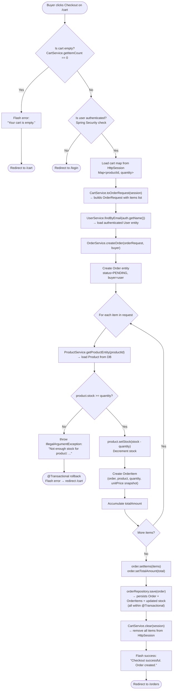

# Activity Diagram — Checkout Flow

This diagram covers the full checkout activity that starts when a buyer clicks "Checkout" on the cart page and ends with either a successful order or an error redirect.

**Key actors / components involved:**

- `CartController.checkout()` — entry point, validates session + auth
- `CartService` — reads session cart and converts it to an `OrderRequest`
- `OrderService.createOrder()` — validates stock, creates `Order` + `OrderItem` entities, decrements stock
- `ProductRepository` — persists the updated stock
- `OrderRepository` — persists the new order

## Transactional Boundary

The entire `createOrder` method is annotated with `@Transactional`. If any step fails (e.g., insufficient stock), the entire database transaction is rolled back — no partial order is written and no stock is decremented. The session cart is **not** cleared on failure.

## Price Snapshot

`unit_price` stored in `OrderItem` is taken directly from `product.getPrice()` **at the time of order creation**. This means future price changes by the seller do not affect historical orders.
