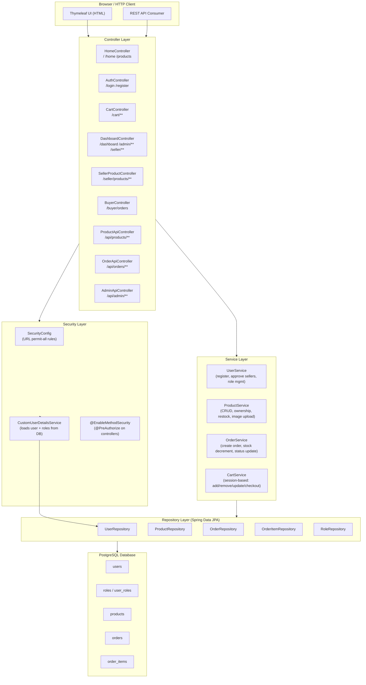

# Architecture Diagram — Hexashop

Hexashop follows a classic **layered Spring MVC architecture**:

- **Controller Layer** — Handles HTTP requests (Thymeleaf MVC + REST under `/api/**`)
- **Service Layer** — Contains all business rules: ownership checks, stock management, order state transitions
- **Repository Layer** — Spring Data JPA interfaces; no raw SQL
- **Database** — PostgreSQL

The cart is **session-based** (stored in `HttpSession`), not persisted to the database.
Spring Security intercepts every request before it reaches a controller.

