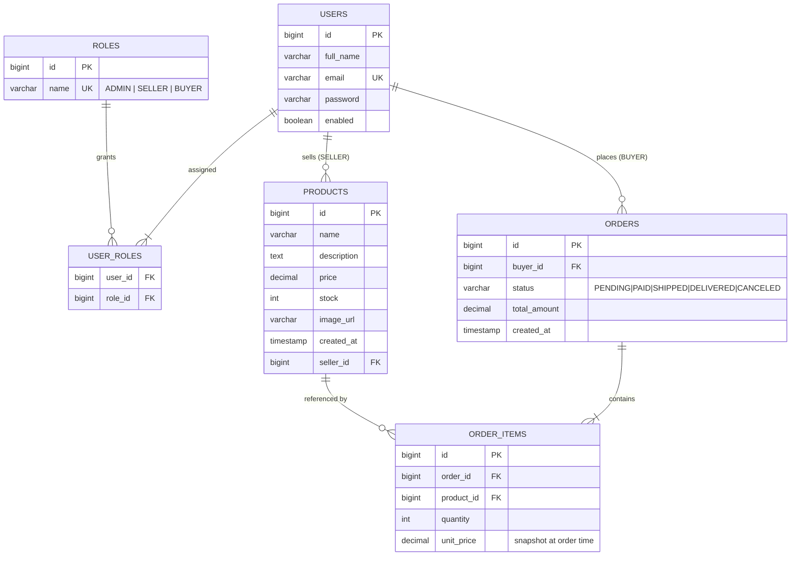

# ER Diagram — Hexashop

Six database tables (no cart table — cart is session-based):

| Table         | Purpose                                                          |
| ------------- | ---------------------------------------------------------------- |
| `users`       | All accounts: admins, sellers, buyers                            |
| `roles`       | Role definitions: ADMIN, SELLER, BUYER                           |
| `user_roles`  | Many-to-Many join between users and roles                        |
| `products`    | Product listings owned by sellers                                |
| `orders`      | Buyer orders with status and total                               |
| `order_items` | Line items inside an order (product + quantity + price snapshot) |

## Key Constraints

| Constraint  | Column(s)                              |
| ----------- | -------------------------------------- |
| PRIMARY KEY | All `id` columns                       |
| UNIQUE      | `users.email`                          |
| UNIQUE      | `roles.name`                           |
| FOREIGN KEY | `products.seller_id → users.id`        |
| FOREIGN KEY | `orders.buyer_id → users.id`           |
| FOREIGN KEY | `order_items.order_id → orders.id`     |
| FOREIGN KEY | `order_items.product_id → products.id` |
| FOREIGN KEY | `user_roles.user_id → users.id`        |
| FOREIGN KEY | `user_roles.role_id → roles.id`        |

## Notes

- `unit_price` in `order_items` is a **price snapshot** captured at order time. If the seller later changes the product price, historical orders are unaffected.
- The **cart has no database table**. It lives entirely in `HttpSession` and is converted to an `OrderRequest` at checkout, then cleared.
- `orders.status` is a JPA `@Enumerated(EnumType.STRING)` field — the enum values are stored as string literals in the DB column, not as integers.
