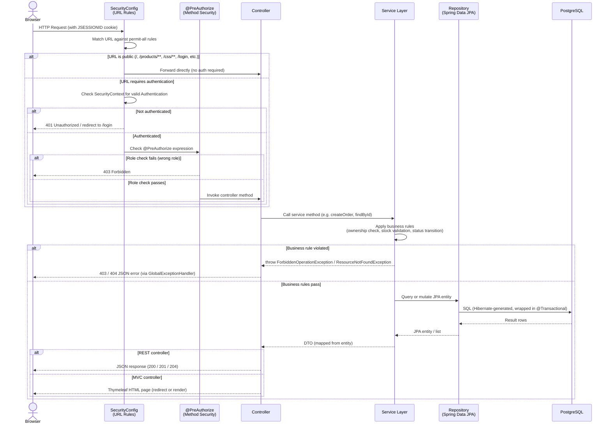

# System Workflow Diagram — Hexashop

This sequence diagram shows the general request/response lifecycle for any HTTP request to Hexashop. Spring Security intercepts every request before it reaches a controller, evaluates URL rules and `@PreAuthorize` annotations, and either blocks the request or forwards it to the appropriate controller.

## Authentication Details

- Spring Security uses `CustomUserDetailsService` to load the user from the database by email (the username field).
- `BCryptPasswordEncoder` compares the submitted password against the stored hash.
- A successful login stores the `Authentication` in `HttpSession` (keyed as `SecurityContext`).
- The `JSESSIONID` cookie is sent to the browser and used on subsequent requests.
- A disabled user (`enabled = false`) is rejected at the `UserDetails.isEnabled()` check inside Spring Security — before any controller code runs.
